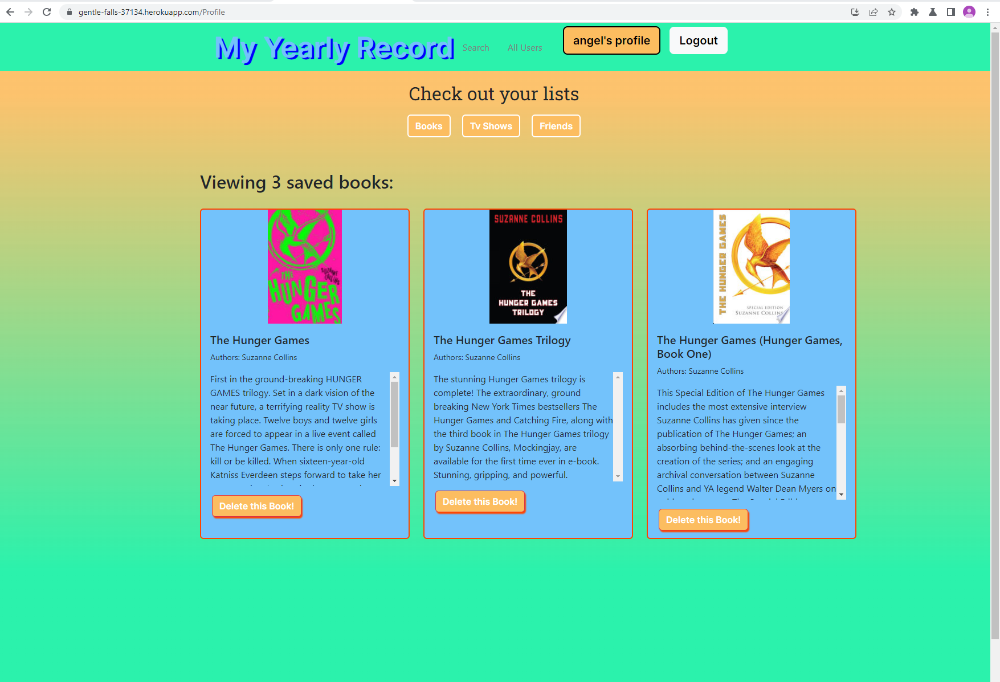
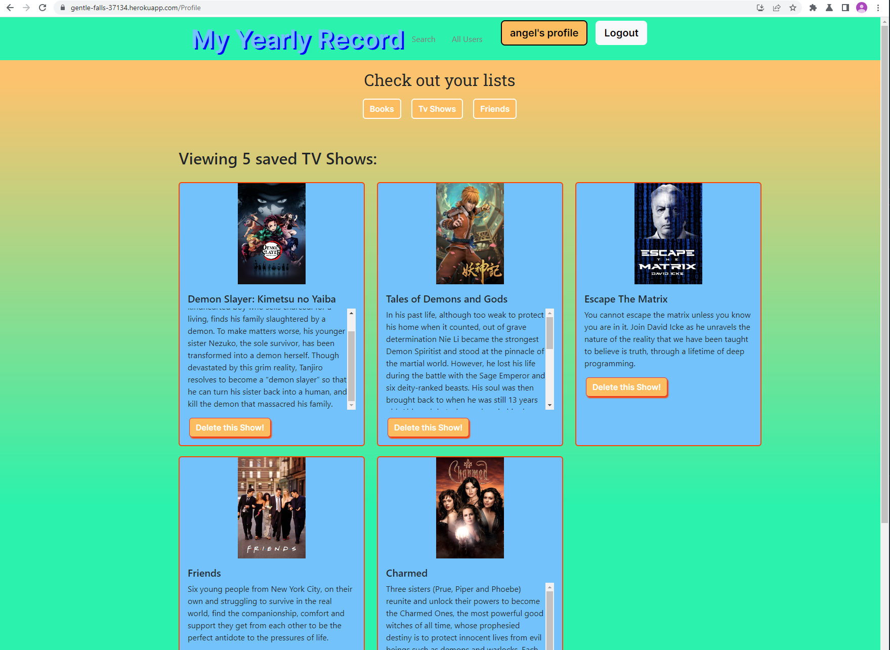

# My_Yearly_Record

My Yearly Record, an easy way to create lists of your interested books or tv shows while making friends with common interest

## Description

This project is to create responsive list to keep track of book and tv shows. The user is able to search and add tv shows and books to their list as well as delete them. The user is also able to add friends, to watch their list and delete a friend.

The idea was born from spotify wrapped. We wanted a way to keep track of the TV shows and books we consumed over a year. This application allows you to search for shows and books. Once you find one you are interested in you can save it to your list. Additionally, you are able to add friends to follow what they are watching and reading. If you select a show or book you are no longer interested in your can remove them from your saved lists.

## Table of Contents

  - [Installation](#Installation)
  - [Usage](#Usage)
  - [License](#License)
  - [Contributions](#Contributions)
  - [Test](#Test)
  - [Questions](#Questions)

## Installation

This application runs in the browser and requires the following packages:
- [apollo-server-express](https://www.npmjs.com/package/apollo-server-express)
- [bcrypt](https://www.npmjs.com/package/bcrypt)
- [dotenv](https://www.npmjs.com/package/dotenv)
- [express](https://www.npmjs.com/package/express)
- [graphql](https://www.npmjs.com/package/graphql)
- [jsonwebtoken](https://www.npmjs.com/package/jsonwebtoken)
- [mongoose](https://www.npmjs.com/package/mongoose)
- [nodemon](https://www.npmjs.com/package/nodemon)
- [@apollo/client](https://www.npmjs.com/package/@apollo/client)
- [@testing-library/jest-dom](https://www.npmjs.com/package/@testing-library/jest-dom)
- [@testing-library/react](https://www.npmjs.com/package/@testing-library/react)
- [@testing-library/user-event](https://www.npmjs.com/package/@testing-library/user-event)
- [antd](https://www.npmjs.com/package/antd)
- [bootstrap](https://www.npmjs.com/package/bootstrap)
- [jwt-decode](https://www.npmjs.com/package/jwt-decode)
- [react](https://www.npmjs.com/package/react)
- [react-bootstrap](https://www.npmjs.com/package/react-bootstrap)
- [react-dom](https://www.npmjs.com/package/react-dom)
- [react-icons](https://www.npmjs.com/package/react-icons)
- [react-router-dom](https://www.npmjs.com/package/react-router-dom)
- [react-scripts](https://www.npmjs.com/package/react-scripts)
- [react-switch](https://www.npmjs.com/package/react-switch)
- [styled-components](https://www.npmjs.com/package/styled-components)
- [web-vitals](https://www.npmjs.com/package/web-vitals)
- [concurrently](https://www.npmjs.com/package/concurrently)

## Links
Github repository site here: [https://github.com/FranklynSuriel/My_Yearly_Record](https://github.com/FranklynSuriel/My_Yearly_Record)

Deployed site here: [https://gentle-falls-37134.herokuapp.com/](https://gentle-falls-37134.herokuapp.com/)

## Usage

When the user start the application, the landing page is presented. The user can search books or tv shows but it can not save the unless the user is logged in. If the user click on **Signup** the user is able to create an account and login into the app. if the user come back at a later time, he is able to click **Login** to log into the app. if the user click on **Search** it will be presented with an option to search for books or tv shows. When the user choose to **Search books** it will be presented with a search bar and is able to search and saved books to their list. if the user choose **Search tv shows** it will be presented with a search bar and is able to search and saved tv shows to their list. When the user click on **All Users** it will be presented with all user that made an account and is able to see their list add them as a friend. When the user click on **User's profile** it will be presented with the options of see their list. If the user click on the **Books** button, is able to watch the books that are saved. If the user click on the **Tv Shows** button, is able to watch the tv shows that are saved. If the user click on the **Friends** button, is able to watch the Friend that are saved. When the user click on **Logout** the user will successfully logged out of the application

## Credits

- Franklyn Suriel 
- Kelsey Morgan 
- Kelsey Alderman
- Upenn Bootcamp Repo.
- Bootcamp Tutors - Matthew Calimbas and Andrew Hardmon.
- Temani Afif - CSS Tricks
- Google Books API
- The Movie Database (TMDB) API.
- Unsplash Images - Francisco Andreotti, and Mo Eid.

U. Penn Bootcamp instructor(s):

- Dan Gross
- Andrew Hojnowski
- Ross King

## License

This project is licensed under the MIT license.

## Contributing

No contributions guidelines.

## Test

No test available.

## Questions

- [github.com/KelseyRA](https://github.com/KelseyRA)
- [github.com/morgankn](https://github.com/morgankn)
- [github.com/FranklynSuriel](https://github.com/FranklynSuriel)

Questions about this project or to report an issue can be sent to:

- kra7888@gmail.com (*Kelsey Alderman*)
- morgankn7@gmail.com (*Kelsey Morgan*)
- fsuriel@gmail.com. (*Franklyn Suriel*)

Please specify the name of the project in the subject of the email.
